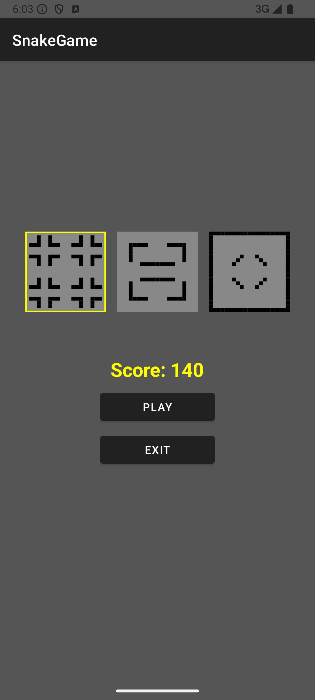
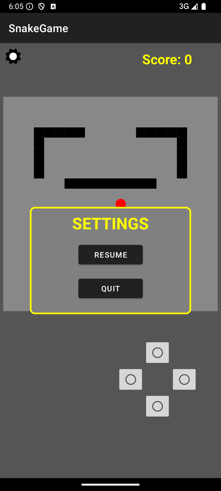
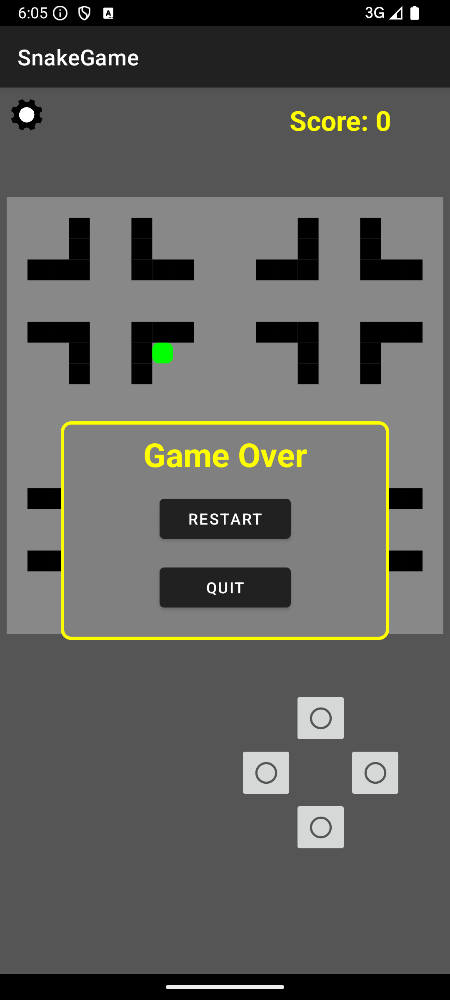
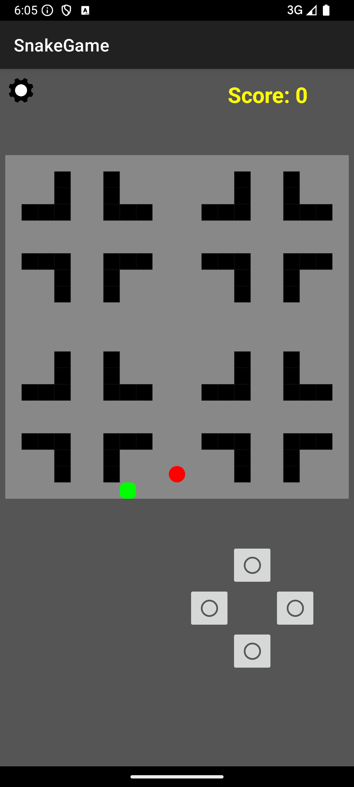
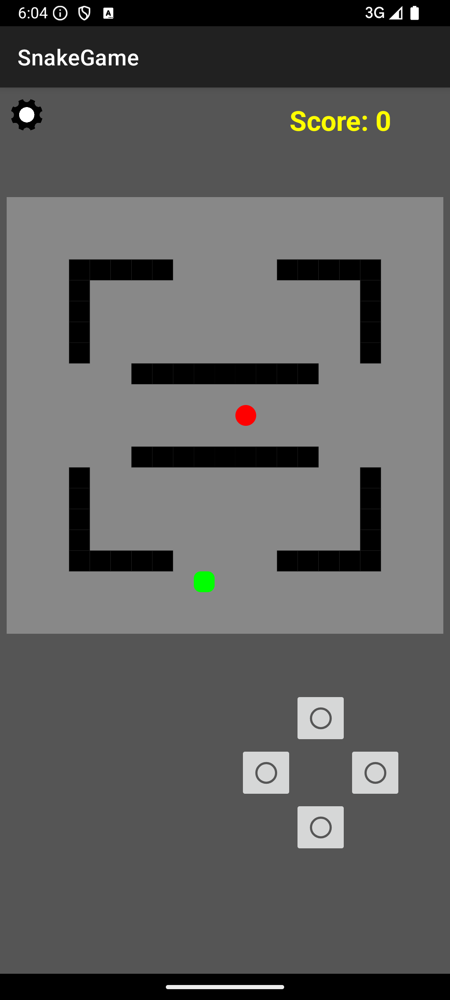
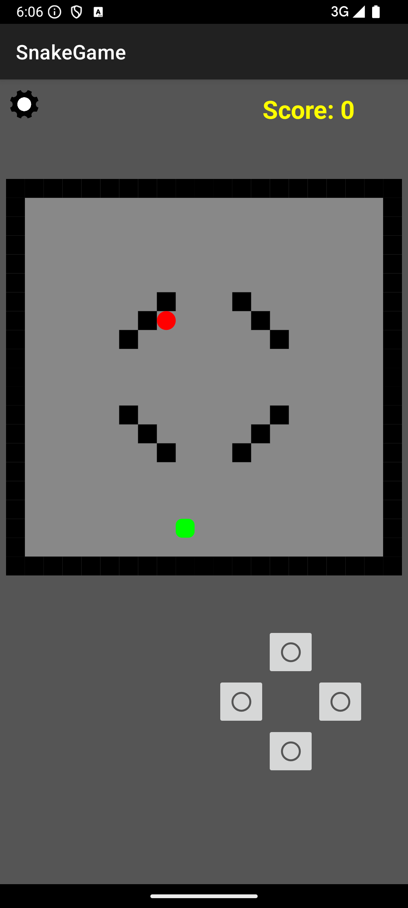

# Snake Game

## Introduction
Classic Snake Game is written by Kotlin.
### Screenshot
|  |  |  |
|-------------------------|-------------------------|-------------------------|  
|  |  |  |

### Description
1. There are **3 map patterns**.
2. Each food **increases 20 points** of score.
3. Each food **lengthens Snake 1 node**.
4. Game would be **over if there is a wall collision or self-collision**.
5. Game **can be paused**.
6. High score is stored persistently.
## Project Structure
### File system
### Explain    
1. Separate into 3 packages
    - components (Activity, Fragment): layer between user interface with application data and logic.
    - animations (View): custom View rendering animations
    - engine (objects): game engine taking on logic of the game
2. Relations:
    - components including event handlers which trigger state of data in engine
    - animation belonging to components, which also get updates from engine.
3. Techniques:
    - collision detection:
        - square detection:
                show your logic of detection
    - design pattern:
        - data binding: manage component from Activity
        - observer: update in-game score
        - coroutine: using to render animation
    - using flag to manage state of animation
## Installations
**Recommendation**: simulating on Android Studio
